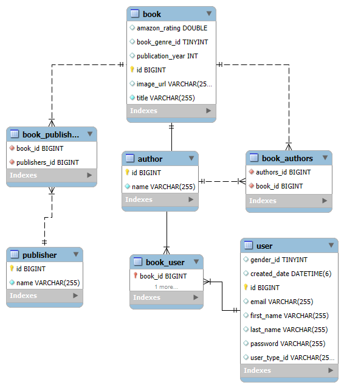

# Project Contents

 - Spring Boot application with Thymeleaf, REST API, JPA and MySQL. 
 - REST services with Spring MVC CRUD.
 - CRUD actions with multiple entities like book, user, author, publisher and created MyRunner to run a set of sample sql queries as a baseline for our project


### Dependencies needed to run the project
    - spring-boot starter (web, data-jpa, thymeleaf), mysql-connector
    - spring validation libraries, springdoc-openapi-starter-webmvc-ui, lombok, devtools

### Tasks
* [x] Creation of Entities named Book, Author, Publisher, BookUser, and User and @OneToMany implementation
* [x] BookUserId as embeddable(reusable component) embedded into BookUser entity
* [x] Added @OneToMany in Book with Author and Publisher entities
* [x] Data manipulation with MySQL
* [x] Data retrieval with JPA - EntityManager to interact with the persistence context(crud actions)
* [x] Controller code and view pages
* [x] Custom and global Exception handlers
* [x] Addition of dynamic field in html, binding list of objects
* [x] Swagger UI doc generation

### springdoc-openapi
   - Used the library to automate the generation of API documentation
   - Configured custom path for swagger UI and api docs
    <!-- https://vimalamoger.github.io/ThrillioWeb/  -->

### Custom Validators - <b style="color:grey;">Validator</b>
  - Implemented a custom UserValidator for email in User class 
  - Implemented a custom BookValidator for book genre in Book class 
  - Created custom validators to override its methods using supports and validate 
  - Register the validator in controller classes
  - Validation if user entered email is valid confirming to a specific format, checking if the book genre exists
   

### Thymeleaf view pages
  - Register page to create user
  - Sign in page with valid credentials
  - Stored users, BCrypt encrypted passwords in DB
  - Books display page with additional action features

### App View
<!-- [onRender](https://book-v8.onrender.com/?target="_blank") -->
<a href="https://book-v8.onrender.com/" target="_blank">onRender</a>

### Build commands 
``` to build - start the service - display app ```

      Maven
        -  mvn clean package
        -  java -jar target/Book-0.0.1-SNAPSHOT.jar
      Docker commands to run manually: 
          Pull mysql image from Docker Hub, create mysql container(san-mysql)
            -  docker pull mysql:latest
            -  docker run -d -p 3308:3306 --name=san-mysql --env="MYSQL_ROOT_PASSWORD=password" --env="MYSQL_PASSWORD=password" --env="MYSQL_DATABASE=book_db" mysql
          Build an Image from a Dockerfile:    
            -  docker build -t book-image .
          Create and run a container from an image, publish its port to mysql host:
            -  docker run -t --link san-mysql:mysql -p 8080:8080 book-image
      docker-compose.yml (book-v1)
        -  docker-compose build
        -  docker-compose up

### Entity Relationship Diagram- 
Database schema, tables, columns and relationship between them


